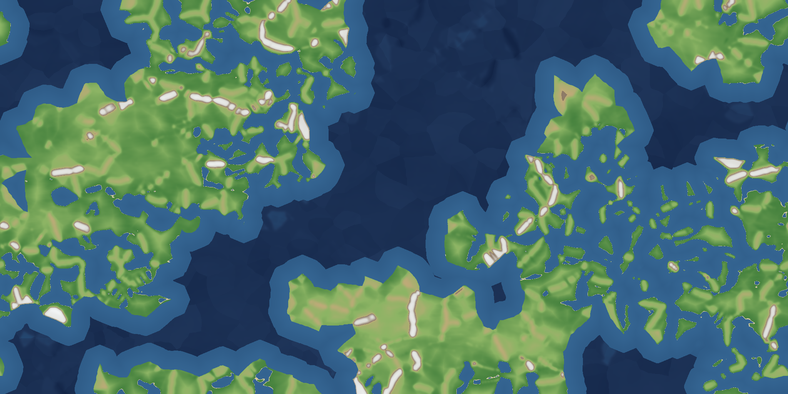
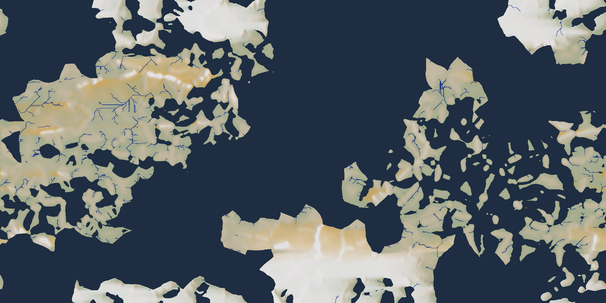
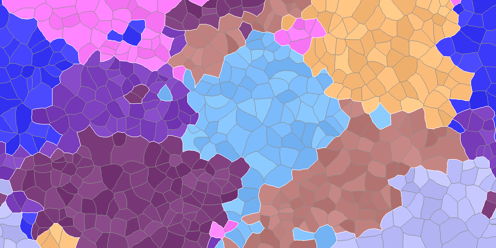
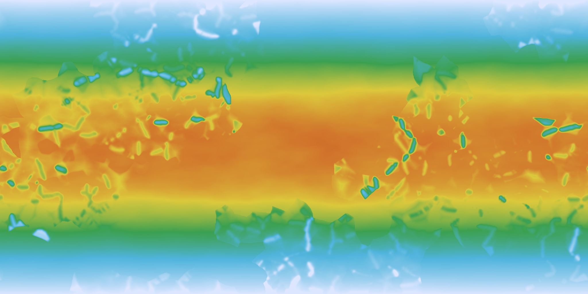

# worldgen

Procedural world generator built in Rust. Generates Earth-like planets from plate tectonics up through climate and hydrology.



## Pipeline

The generator runs in stages, each building on the previous:

**Stage 1 -- Plate Tectonics & Elevation**
- ~600 microplates grouped into ~8 macroplates via noise-weighted Dijkstra growth
- Variable-density seeding (denser fracturing near macroplate boundaries)
- Convergent/divergent/transform boundary classification (major vs minor)
- Elevation from boundary profiles: mountains at convergent zones, trenches at subduction zones, rifts at divergent zones
- Continental shelf, coastal taper, interior terrain noise, per-pixel detail noise

**Stage 2 -- Climate & Hydrology**
- Temperature: latitude gradient (equator 30C to poles -30C) + lapse rate + FBM noise
- Precipitation: Hadley-cell wind model with row-wise moisture advection, orographic lift, evapotranspiration, ITCZ/subtropical modulation
- Rivers: 8x upscale, meander noise, Barnes priority flood (ocean-seeded), D8 flow direction, flow accumulation, per-basin upstream extension, valley carving



## Features

- Fully deterministic from seed
- Resolution-independent (512x256 to 4096x2048)
- Interactive web UI with real-time parameter tuning
- Progressive loading: base map renders in ~2s, rivers compute asynchronously (~8s at 2048x1024)
- All computation parallelized via Rayon

## Gallery

| Plates | Temperature |
|--------|-------------|
|  |  |

## Building

Requires Rust (stable) and Node.js.

```bash
# Build backend
cargo build --release

# Build frontend
cd frontend && npm install && npm run build && cd ..

# Run CLI
cargo run --release --bin worldgen -- <seed> <width> <height> <output_dir>

# Run web server (localhost:3000)
cargo run --release --bin server
```

## Web UI

The web interface at `localhost:3000` provides:
- Layer tabs: Plates, Boundaries, Distance, Heightmap, Map, Temperature, Precipitation, Rivers
- Top-bar controls: seed, resolution, plate count, land fraction, boundary noise
- Tune panel: mountain scale/width, coastline noise, interior terrain, detail, shelf width, rainfall, river density

## Architecture

```
src/
  lib.rs          -- pipeline orchestration, Map struct
  plates/
    seed.rs       -- Poisson-disk plate seeding (variable density)
    grow.rs       -- noise-weighted Dijkstra plate growth
    properties.rs -- plate properties (continental/oceanic, velocities)
    boundary.rs   -- boundary extraction and classification
    distance.rs   -- JFA boundary distance field
  elevation.rs    -- boundary profiles + noise layers
  climate.rs      -- temperature + precipitation
  hydrology.rs    -- upscale, priority flood, D8 flow, river extraction, valley carving
  render.rs       -- all visualization functions
  config.rs       -- tunable parameters
  grid.rs         -- 2D grid with E-W wrapping
  noise.rs        -- FBM noise
  rng.rs          -- splitmix64/32 deterministic RNG
  bin/
    server.rs     -- Axum web server
  main.rs         -- CLI entry point

frontend/
  index.html      -- UI layout + styles
  src/app.ts      -- TypeScript application
```

## License

MIT
